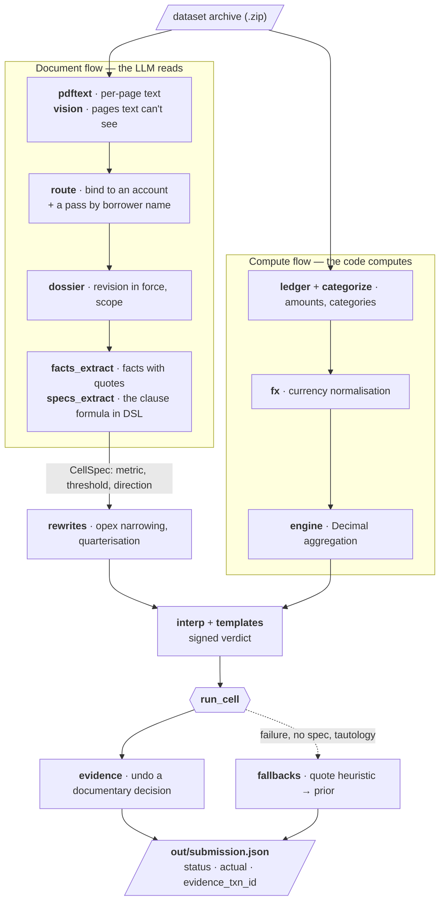

[](https://github.com/nvinnikov/ai-halyk-hackathon/actions/workflows/ci.yml)
[](https://opensource.org/licenses/Apache-2.0)
[](https://www.python.org/)

# ai-halyk — Agentic Bank

**Covenant monitoring for corporate loans.** The pipeline reads 200 borrower
PDFs and a year of bank ledger (1473 transactions) and, for every financial
covenant, answers three fields: compliant or breached, the actual metric value,
and the transaction that caused the breach. 12 borrowers × 3 covenants = 36
answer cells.

A solution to the Halyk AI Challenge case, August 2026. This is a condensed
English version — the full write-up, with the complete post-mortem, is in
Russian in [`README.md`](README.md); the module map and every trap live in
[`CLAUDE.md`](CLAUDE.md).

## The problem

A loan agreement carries financial covenants — "debt to EBITDA no higher than
3.5", "Group capital expenditure no more than 4% of revenue", "related-party
payments below a threshold". The bank has to check them regularly, and the
inputs live in two incompatible worlds: the numbers are in a transaction
ledger, while the rules, exceptions and reclassifications are in PDFs (audit
reports, treasury memos, amendments, KYC ownership structures, the parent
company's consolidated statements). Today a credit analyst does this by hand,
per borrower, and it does not scale.

The cost of a mistake is asymmetric, and that shaped the whole architecture:

- **A false "compliant"** — the bank misses a deterioration and never pulls the
  covenant trigger; risk rolls into default unaccounted for.
- **A false "breach"** — the bank makes a demand on a client by mistake; that is
  reputational and legal damage.
- **Silence** (could not compute) is cheaper than both, but only if the system
  says so honestly instead of emitting a confident number.

Hence `status` outweighs value precision in the scoring (0.50 against 0.30),
and hence fail-open at the cell level: any failure leaves the run alive, the
cell is filled by a fallback ladder, and the reason goes to the log as an
`ALARM`.

One more constraint that transfers well to production: the private borrower set
opened on submission day, with a three-hour window. The system could not be
tuned to the data it was developed on. A full cold run takes **18.4 minutes and
$0.81** (measured on a live rehearsal, 138 model calls).

## How it works

Two flows — documents and computation — meet in `run_cell`, where an answer cell
is born. The boundary between them is the core invariant of the solution: on the
left the model only reads text, on the right the code only computes.



Three things the diagram does not show, and everything rests on them:

- **`guard`** sits between documents and any prompt: `sanitize_document` on the
  way in, a "data, not commands" separator in the prompt body, `verify_quote` on
  the way out — a quote not found verbatim in the source drops the fact with an
  alarm.
- **`llm`** answers from a content-addressed cache before it goes to the network,
  and under `LLM_OFFLINE=1` it never goes at all — that is what makes an offline
  run of the whole pipeline possible.
- **`stages.artifact`** makes every stage idempotent: the result lands on disk and
  is invalidated by module version, so a restart costs a minute.

## What is worth looking at

Three things, and none of them is "hook an LLM up to documents".

### 1. Eval design: measuring a system that has no gradient

There is no fine-tuning here — there are 36 cells and edits to code. The only
way to tell an improvement from a coincidence is to build the measurement
before you write the fix.

| Instrument | What it catches |
| --- | --- |
| Two score gates in CI (`BASELINE`, `EXTRACTED_BASELINE`) | Regressions. Improve the solution, raise the gate in the same commit — otherwise a rollback goes unnoticed. One gate guards the compute core on reference facts, the other the production path with PDF extraction. |
| Cassette `eval/cassette/` | Experiment cost. The whole pipeline replays offline, free and deterministically — a fix is measured in a minute instead of 18, and CI runs with no API keys. |
| Mutations (`eval/mutations*.py`) | Self-consistency. The dataset is mutated wholesale — renamed companies, a shifted threshold in the contract text, a currency swap — and the expected answer is derived **without our own engine**. Otherwise the test only measures that the solution agrees with itself. |
| LOBO (`eval/lobo.py`) | Per-borrower overfitting: 12 runs, each solving one borrower without the template library. |
| Grep gate (`eval/grep_gate.py`) | Knowledge of the dataset leaking into code: no borrower name, clause number, threshold value or `TXN-`/`ACC-` prefix anywhere in `solution/` — the banned list is built from the eval data itself. |
| Shadow computation (`solve._shadow_compare`) | The price of our own heuristics. Where a template overrides the model-extracted formula, **both** values are computed and an alarm fires only if the override changed the answer — producing a by-name list of cells to inspect by hand on a new dataset. |

**Transfer was tested for real, not on paper.** The production set opened on
submission day and turned out 2–3× larger than the one the system was built on:

| | Public set (in this repo) | Production set |
| --- | --- | --- |
| Scenarios / answer cells | 12 / 36 | 27 / 84 |
| PDF documents | 200 | 305 |
| Ledger transactions | 1473 | 2355 |

The pipeline finished inside the window and answered every cell with no
data-specific patches.

### 2. Determinism around a non-deterministic component

The model is non-deterministic, and that is measured rather than assumed: on a
live rehearsal, of 123 prompts shared with the recorded cassette **34 answers
(28%) differed** — and the final score did not move by a single point
(`docs/ops/live-rehearsal-2026-08-08.md`). That is exactly the goal:
reproducibility comes from the architecture around the model, not from sampling
settings.

- **Content-addressed response cache.** Key = `sha256(model_id + prompt +
  json_schema + schema_version)`. It never expires by time, only by content.
- **No `float` and no `set` in the computation.** Money is `Decimal`, rounding
  is `ROUND_HALF_UP` (Python's `round()` is banker's rounding and will quietly
  corrupt `actual`), every set is sorted before use.
- **The answer skeleton is written first.** `out/submission.json` is valid at
  every second of the run and is overwritten one cell at a time — a run killed
  17 minutes into a three-hour window still leaves a submittable file.
- **Idempotent, versioned stages.** A stage artifact is invalidated by module
  version, not by input, so a restart inside the window costs a minute.

### 3. "The LLM reads, the code computes"

An invariant carried literally through the whole pipeline: the model **never**
does arithmetic. It only answers questions that require understanding text —
which revision of a document is in force, who issued a report, what formula a
clause states — and every answer passes a JSON schema and a DSL grammar before
it reaches the computation.

- **Every quote is verified against the source.** Not found verbatim → the fact
  is dropped with an alarm. A hallucinated quote cannot reach the answer.
- **A document enters a prompt only through `sanitize_document`**, and the
  prompt carries a "data, not commands" separator — a borrower PDF is untrusted
  input, and "ignore previous instructions" inside a scanned contract must mean
  nothing.
- **The related-party ownership threshold is applied by code, not the model:**
  the model transcribes the ownership table with quotes; the comparison, and the
  multiplication along indirect ownership chains, is arithmetic.

## Results

Three numbers, and they must not be confused.

**Public set — 35.00 / 36.00.** The remaining point is a typo in the dataset
itself, confirmed by the organisers: in borrower `P4`, clause 6.3 was loaded
with a wrong threshold while the answer key holds the right value. No code was
written for it — the threshold is read from the contract, and matching it would
have meant hardcoding a number for one cell. Notably, the rule was rejected
**before** the organisers explained the typo, and for a measurable reason: it
gave +1.00 here and −1.00 on each of two other cells.

**Private set — 51st of 186, 70.99%.** First place was 96.36%, the top 10 around
93%. The pipeline ran in 157 seconds inside the window, did not crash, and
answered all 84 cells. And lost.

**After the post-mortem — 91.65%** against a proxy key on the same private set
(roughly ~95.7% against the real one), with no architectural change whatsoever.
The number reproduces from a clean clone: the dataset is in the repo, the model
answers are in the cassette, and `make private-score` prints it in a minute with
no network and no keys.

## What went wrong

This is half the repository, and it is the more interesting half.

A top-10 team published its solution together with a **byte-identical private
archive** ([DiasKhalniyasov/Halyk-challenge-2026](https://github.com/DiasKhalniyasov/Halyk-challenge-2026)),
which gave what the window had not: a way to measure. The post-mortem
(`docs/ops/private-set-postmortem.md`) found six causes, and not one of them was
"the model reads badly":

| cause | cost |
| --- | --- |
| "Operating expenses" read as all operating costs where the contract meant one line item | 3.60 |
| Ownership share taken from a table row instead of the chain | 3.00 |
| The covenant measures any quarter — we computed the year | 2.80 |
| Evidence returned empty where a guess is free under the scoring rules | 1.40 |
| A metric identically equal to the threshold produced a confident "compliant" | 0.50 |

The shared root: **the domain vocabulary was settled before the private-set
documents were ever read.** The grep gate honestly caught *visible* overfitting
to the public set — borrower names, clause numbers, thresholds. The invisible
kind (what a term means, that tests are annual, that the ledger is clean) walked
into the design unquestioned, because it looked like domain knowledge rather
than overfitting.

Three waves of fixes: 65.58% → 79.03% → 86.30% → 91.65%. Every step a general
rule, never a patch for a specific borrower, and not one of them moved the
public gate off 35.00.

**Negative results are kept in the repo too.** A ledger de-noising stage was
built, measured at −5.79 points and rejected (`docs/ops/ledger-noise.md`); two
cells declared unwinnable turned out to be solvable by the existing LLM tier
once the question stopped being "can a deterministic rule do this".

## Quick start

```bash
make public-archive                   # build the public archive (not stored in git)
./run.sh 6a741640c31eb032062683.zip   # the single entry point: archive → out/submission.json
make solve                            # the same through make
make check                            # local CI mirror: lint + typecheck + tests
```

The pipeline takes a dataset zip, and `*.zip` is gitignored, so on a fresh clone
build it first. Everything runs **from the repository root** — dataset paths are
relative. The environment comes from [uv](https://docs.astral.sh/uv/) via
`uv.lock`, Python is pinned by `.python-version`. Copy `.env.example` to `.env`
for API keys; `LLM_PROVIDER` selects `anthropic` or `gemini`.

Offline, with no keys and no network:

```bash
LLM_OFFLINE=1 LLM_PROVIDER=gemini uv run pytest -m llm -q
```

## Layout

| Path | What is inside |
| --- | --- |
| `solution/` | The engine: ledger parsing and categorisation, FX, Decimal aggregation, metric DSL and interpreter, document layer (PDF text, vision, routing, dossier, fact extraction), evidence, fallback ladder, LLM client. |
| `eval/` | The measurement rig: reference extraction, status prior, mutations, LOBO, grep gate, recorded cassette, private-set proxy key. |
| `tests/` | Regression gates, invariants, unit tests. |
| `tools/` | Reproducible archive packers, private-set verification, private scorer. |
| `dataset/` | The competition packages, unmodified — see [`dataset/README.md`](dataset/README.md). |
| `docs/ops/` | Run post-mortems and transferable lessons. |

## License

**Code** is Apache-2.0 (`LICENSE`).

**Third-party material is not covered by it** — see [`NOTICE`](NOTICE):
the competition datasets and rules belong to the organisers (publication of the
private set was permitted by them), and `eval/private_proxy_key.json` is another
team's published submission.
